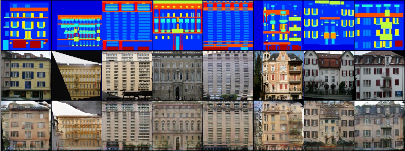

# pix2pix

#### Title
[Image-to-Image Translation with Conditional Adversarial Networks](https://arxiv.org/abs/1611.07004)

#### Abstract
We investigate conditional adversarial networks as a general-purpose solution to image-to-image translation problems. These networks not only learn the mapping from input image to output image, but also learn a loss function to train this mapping. This makes it possible to apply the same generic approach to problems that traditionally would require very different loss formulations. We demonstrate that this approach is effective at synthesizing photos from label maps, reconstructing objects from edge maps, and colorizing images, among other tasks. Indeed, since the release of the pix2pix software associated with this paper, a large number of internet users (many of them artists) have posted their own experiments with our system, further demonstrating its wide applicability and ease of adoption without the need for parameter tweaking. As a community, we no longer hand-engineer our mapping functions, and this work suggests we can achieve reasonable results without hand-engineering our loss functions either.

        
## Train
    $ python main.py --mode train \
                     --scope [scope name] \
                     --name_data [data name] \
                     --dir_data [data directory] \
                     --dir_log [log directory] \
                     --dir_checkpoint [checkpoint directory] \
                     --direction [A2B or B2A]
---
    $ python main.py --mode train \
                     --scope pix2pix \
                     --name_data facades \
                     --dir_data ./datasets \
                     --dir_log ./log \
                     --dir_checkpoint ./checkpoint \
                     --direction B2A

* Set **[scope name]** uniquely.
* To understand hierarchy of directories based on their arguments, see **directories structure** below. 
* Hyperparameters were written to **arg.txt** under the log directory.

## Test
    $ python main.py --mode test \
                     --scope [scope name] \
                     --name_data [data name] \
                     --dir_data [data directory] \
                     --dir_log [log directory] \
                     --dir_checkpoint [checkpoint directory] \
                     --direction [A2B or B2A] \
                     --dir_result [result directory]
---
    $ python main.py --mode test \
                     --scope pix2pix \
                     --name_data facades \
                     --dir_data ./datasets \
                     --dir_log ./log \
                     --dir_checkpoint ./checkpoints \
                     --direction B2A \
                     --dir_result ./results

* To test using trained network, set **[scope name]** defined in the **train** phase.
* Generated images are saved in the **images** subfolder along with **[result directory]** folder.
* **index.html** is also generated to display the generated images.  

## Tensorboard
    $ tensorboard --logdir [log directory]/[scope name]/[data name] \
                  --port [(optional) 4 digit port number]
---
    $ tensorboard --logdir ./log/pix2pix/facades
                  --port 6006
                  
After the above comment executes, go **http://localhost:6006**

* You can change **[(optional) 4 digit port number]**.
* Default 4 digit port number is **6006**.

## Results

    1st row: input-segmentation (domain B)
    2nd row: label-photo (domain A)
    3rd row: output-pix2pix

* The results were generated by a network trained with **facades** dataset during **200 epochs**.
* After the Test phase runs, execute **display_result.py** to display the figure.

## Directories structure
    pytorch-pix2pix
    +---[dir_checkpoint]
    |   \---[scope]
    |       \---[name_data]
    |           +---model_epoch00000.pth
    |           |   ...
    |           \---model_epoch12345.pth
    +---[dir_data]
    |   \---[name_data]
    |       +---test
    |       |   +---000000.png
    |       |   |   ...
    |       |   \---12345.png
    |       +---train
    |       |   +---000000.png
    |       |   |   ...
    |       |   \---12345.png
    |       +---val
    |       |   +---000000.png
    |       |   |   ...
    |       |   \---12345.png
    +---[dir_log]
    |   \---[scope]
    |       \---[name_data]
    |           +---arg.txt
    |           \---events.out.tfevents
    \---[dir_result]
        \---[scope]
            \---[name_data]
                +---images
                |   +---00000-input.png
                |   +---00000-label.png
                |   +---00000-output.png
                |   |   ...
                |   +---12345-input.png
                |   +---12345-label.png
                |   +---12345-output.png
                \---index.html

---

    pytorch-pix2pix
    +---checkpoints
    |   \---pix2pix
    |       \---facades
    |           +---model_epoch0000.pth
    |           |   ...
    |           \---model_epoch0200.pth
    +---datasets
    |   \---facades
    |       +---test
    |       |   +---1.jpg
    |       |   |   ...
    |       |   \---106.jpg
    |       +---train
    |       |   +---1.jpg
    |       |   |   ...
    |       |   \---400.jpg
    |       +---val
    |       |   +---1.jpg
    |       |   |   ...
    |       |   \---100.jpg
    +---log
    |   \---pix2pix
    |       \---facades
    |           +---arg.txt
    |           \---events.out.tfevents
    \---results
        \---pix2pix
            \---facades
                +---images
                |   +---00000-input.png
                |   +---00000-label.png
                |   +---00000-output.png
                |   |   ...
                |   +---00106-input.png
                |   +---00106-label.png
                |   +---00106-output.png
                \---index.html
 
* Above directory is created by setting arguments when **main.py** is executed.               
        